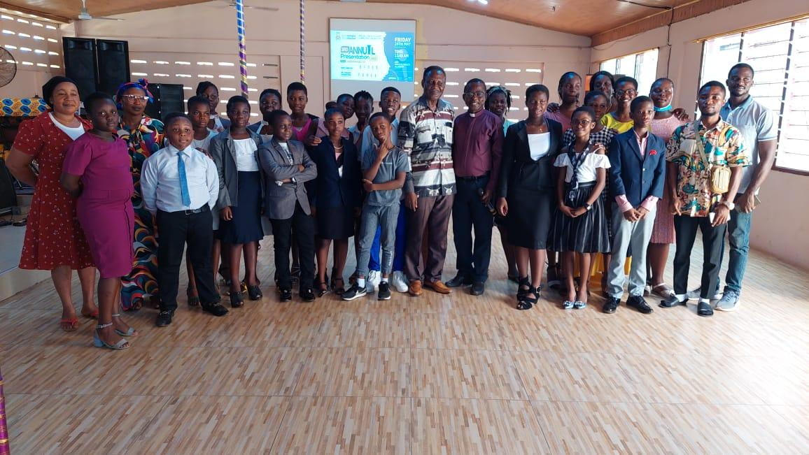

<p align="center">
  
</p>

<h1 align="center">🦅 BEEVIF</h1>
<p align="center"><strong>Baiden Etsiakoh Eagle Vision Foundation</strong></p>
<p align="center"><em>Fighting poverty, poor health, and ignorance in rural Ghana — one family at a time. 🇬🇭</em></p>

<p align="center">
  
  
  
  
  
</p>

---

## 🌍 About

The official website for the **Baiden Etsiakoh Eagle Vision Foundation (BEEVIF)**, a registered non-profit based in Ghana. It's the foundation's digital home — showcasing programmes, impact, and leadership, and giving donors, sponsors, and volunteers a way to get involved. ✨

BEEVIF operates across three core pillars:

| Pillar | Focus |
|---|---|
| 📚 Education | Schools, scholarships, and digital skills training |
| 🏥 Health | Free medical outreach in rural communities |
| 🌾 Food Security | Clothing drives, relief distribution, and nutrition programmes |

## 🧭 Pages

| Page | Contents |
|---|---|
| 🏠 **Home** | Hero slideshow, mission overview, impact stats, testimonials |
| 💛 **About** | Foundation story, core values, leadership team |
| 🛠 **Our Work** | Breakdown of all six active programmes |
| 🤝 **Get Involved** | Sponsorship, donations, and volunteering |
| ✉️ **Contact** | Contact form, phone, email, and address |

## ⚙️ Tech Stack

| Tool | Purpose |
|---|---|
| ▲ Next.js 16 (App Router) | Framework |
| ⚛️ React 19 | UI library |
| 🔷 TypeScript 5 | Type safety |
| 🎨 Tailwind CSS 4 | Styling |
| 🧩 React Icons | Icon set |
| 📮 Formspree | Contact form handling |
| ▲ Vercel | Hosting & deployment |

## 🚀 Getting Started

```bash
git clone https://github.com/AdikaNathaniel/BEEVIF.git
cd BEEVIF/website
npm install
npm run dev
```

Open [http://localhost:3000](http://localhost:3000) 🎉

**Production build:**

```bash
npm run build
npm run start
```

## 📁 Project Structure

```
BEEVIF/
├── website/
│   ├── app/                  # Next.js pages (App Router)
│   │   ├── page.tsx          # Home
│   │   ├── about/
│   │   ├── our-work/
│   │   ├── get-involved/
│   │   └── contact/
│   ├── components/           # Reusable client components
│   └── public/images/        # Image assets
└── images/                   # Source image library
```

## 🌟 Key Features

- 🎞 **Hero Slideshow** — 9 rotating background images with Ken Burns zoom and crossfade transitions
- 🪄 **Scroll Animations** — Section headings, programme cards, and team cards animate into view
- ♾️ **Infinite Carousel** — "Ways to Help" cards scroll horizontally, pausing on hover
- 📱 **Fully Responsive** — Mobile-first, built with Tailwind breakpoints
- 🎨 **On-brand** — Navy (`#1B3A6B`) and Coral (`#E8652A`) throughout

## 🎨 Brand Colours

| Name | Hex | |
|---|---|---|
| Navy | `#1B3A6B` | 🟦 |
| Coral | `#E8652A` | 🟧 |
| Navy Dark | `#122848` | 🟦 |
| Coral Dark | `#c94f18` | 🟧 |

## 📞 Contact

| Channel | Details |
|---|---|
| 📞 Phone | +233 30242 3348 |
| ✉️ Email | info@beevif.org |
| 📍 Address | P.O Box AN15698, Accra-North, Ghana |

---

<p align="center">
❤️ Built as a volunteering effort in support of BEEVIF's mission to empower communities across rural Ghana through education, healthcare, and food security.
</p>

<p align="center"><em>"We thrive to fight poverty, poor health, and ignorance among rural dwellers while spreading the gospel of hope across Ghana." — BEEVIF Foundation</em></p>

<p align="center">🙏 © Baiden Etsiakoh Eagle Vision Foundation. All rights reserved.</p>
